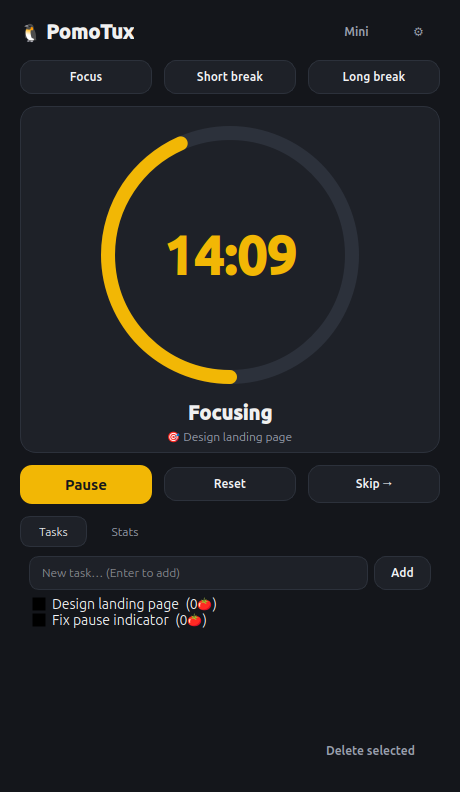
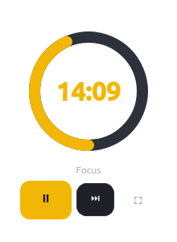

# PomoTux

<p align="center">
  
</p>

<p align="center">
  <a href="https://github.com/imamAtif/PomoTux/actions/workflows/package.yml"></a>
  <a href="https://github.com/imamAtif/PomoTux/releases"></a>
</p>

<p align="center"><b>A lightweight, good-looking Pomodoro timer for Linux.</b><br>Native Qt, ~30&nbsp;MB RAM, no Electron, no accounts, no tracking.</p>

<p align="center">
  
  
</p>

---

## What it is

PomoTux is a Pomodoro technique timer that stays out of your way: focus for 25
minutes, break for 5, long break after every 4th session. On top of the timer
you get the pieces that make the technique stick: tasks linked to sessions,
daily goals with streaks, a mini player, tray integration and Linux-native
notifications.

- **Timer**: 25 / 5 / 15 defaults, fully customizable, with presets via mode buttons
- **Mini + full mode**: floating always-on-top ring, or the full dashboard (Spotify-style toggle)
- **Tasks**: link the current task to the timer; completed pomodoros count per task
- **Stats**: today's progress vs. daily goal, 7-day bar chart, day streak: all local SQLite
- **Desktop integration**: tray icon with live time, native notifications, chime, minimize-to-tray, autostart
- **Focus extras (all opt-in)**: GNOME Do-Not-Disturb, fullscreen break reminder, host blocker list
- **Themes**: follows your GNOME/KDE dark/light mode, with accent-color picker and Tux branding
- **Private by design**: everything stays on your machine; move devices with one JSON export/import

## Install

Grab the latest build from the
[Releases page](https://github.com/imamAtif/PomoTux/releases)
(`dev` is the rolling automatic build, `v*` are stable):

| Format | Install |
|---|---|
| AppImage | `chmod +x PomoTux-*.AppImage && ./PomoTux-*.AppImage` |
| .deb (Debian/Ubuntu) | `sudo apt install ./pomotux-*.deb` |
| .rpm (Fedora/openSUSE) | `sudo dnf install ./pomotux-*.rpm` |
| Flatpak | `flatpak install --user pomotux-*.flatpak` |
| Tarball | `tar -xzf PomoTux-*.tar.gz && ./PomoTux/PomoTux` |

## Use it

1. **First launch**: an onboarding dialog asks which extras you want (DND,
   blocker, break overlay). Everything is optional and changeable later.
2. **Pick a task** (optional): add one under *Tasks*, click it so the timer
   shows it as the current goal.
3. **Hit Start** (or `Space`): work until the chime. Finishing a focus
   session logs it and starts your break.
4. **Skipping**: `N` skips the current phase, `M` toggles the mini player.
5. **Track**: the *Stats* tab shows today vs. your daily goal and your streak.
6. **Move machines**: *Settings → Export JSON*, then *Import JSON* on the
   other device. No cloud involved.

Settings (durations, theme, shortcuts, sounds, autostart, blocked hosts) all
live behind the ⚙ button, and persist to `~/.config/pomotux/settings.json`.

## Build from source

```bash
python3 -m venv .venv
.venv/bin/pip install -r requirements.txt
.venv/bin/python main.py
```

Requirements: Python 3.10+ and `PySide6-Essentials` (installed via
`requirements.txt`). Every push to `main` is packaged automatically:
tarball, AppImage, .deb, .rpm and Flatpak: see
[.github/workflows/package.yml](.github/workflows/package.yml).

## Project layout

```
main.py                 entry point (--mini, --version)
pomotux/
  timer.py              Pomodoro state machine (1s QTimer)
  store.py              SQLite tasks/sessions + JSON backup
  config.py             settings load/save
  theme.py              dark/light QSS builder
  widgets.py            progress ring + week bars (custom painted)
  main_window.py        dashboard: timer, tasks, stats, tray
  mini_window.py        frameless mini player
  dialogs.py            onboarding, settings, break overlay
  platform_linux.py     notifications, DND, autostart
packaging/              desktop file, icons, flatpak manifest, CI assets
tests/                  pytest suite (timer, store, UI state)
pomotux.spec debian/    native distro packaging (COPR, PPA)
```
